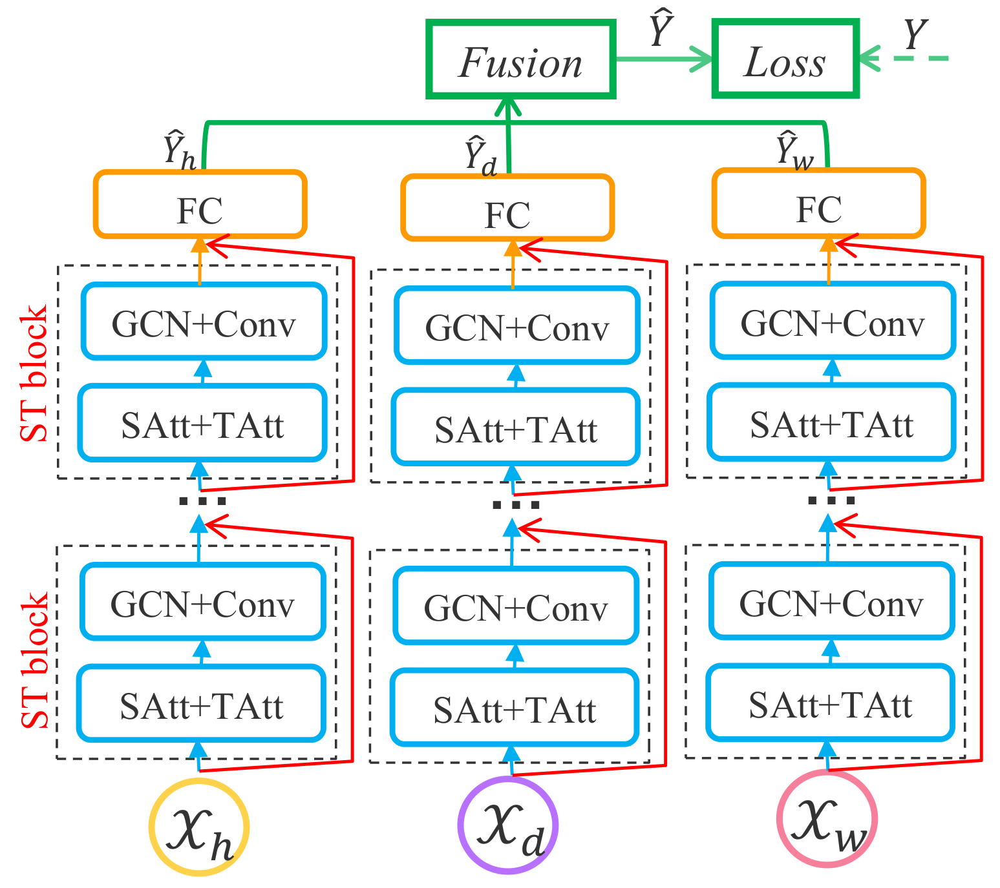

# ASTGCN

Attention Based Spatial-Temporal Graph Convolutional Networks for Traffic Flow Forecasting (ASTGCN)



# References

[Shengnan Guo, Youfang Lin, Ning Feng, Chao Song, Huaiyu Wan(*). Attention Based Spatial-Temporal Graph Convolutional Networks for Traffic Flow Forecasting. The 33rd AAAI Conference on Artificial Intelligence (AAAI'19) 2019.] ("papers/2019 AAAI_Attention Based Spatial-Temporal Graph Convolutional Networks for Traffic Flow Forecasting.pdf")

# Datasets

We validate our model on two highway traffic datasets PeMSD4 and PeMSD8 from California. The datasets are collected by the Caltrans Performance Measurement System ([PeMS](http://pems.dot.ca.gov/)) ([Chen et al., 2001](https://trrjournalonline.trb.org/doi/10.3141/1748-12)) in real time every 30 seconds. The traffic data are aggregated into every 5-minute interval from the raw data. The system has more than 39,000 detectors deployed on the highway in the major metropolitan areas in California. Geographic information about the sensor stations are recorded in the datasets. There are three kinds of traffic measurements considered in our experiments, including total flow, average speed, and average occupancy.

We provide two dataset: PEMS-04, PEMS-08

1. PEMS-04:
   
   307 detectors  
   Jan to Feb in 2018  
   3 features: flow, occupy, speed.

2. PEMS-08:
   
   170 detectors  
   July to Augest in 2016  
   3 features: flow, occupy, speed.

# Requirements

+ python >= 3.5
+ mxnet >= 1.3.0
+ mxboard
+ scipy
+ tensorboard

To install MXNet correctly, you should follow the instruction provided by [this page](https://mxnet.incubator.apache.org/install/index.html?platform=Linux&language=Python&processor=CPU).

To run mxboard, you have to install tensorboard.

Other dependencies can be installed using the following command:
```
pip install -r requirements.txt
```

If you are using docker, install [nvidia-docker](https://github.com/NVIDIA/nvidia-docker) and run the commands below:
```bash
# build image
docker build -t astgcn/mxnet:1.4.1_cu100_mkl_py35 -f docker/Dockerfile .

# training model in background
docker run -d -it --rm --runtime=nvidia -v $PWD:/mxnet --name astgcn astgcn/mxnet:1.4.1_cu100_mkl_py35 python3 train.py --config configurations/PEMS04.conf --force True
```

# Usage

train model on PEMS04:
```
python train.py --config configurations/PEMS04.conf --force True
```

train model on PEMS08:
```
python train.py --config configurations/PEMS08.conf --force True
```

visualize training progress:
```
tensorboard --logdir logs --port 6006
```
then open [http://127.0.0.1:6006](http://127.0.0.1:6006) to visualize the training process.

# Improvements

1. We use convolutional operation to map the output of ASTGCN block to the label space because that can help the model achieve a better performance.

# Configuration

The configuration file config.conf contains three parts: Data, Training and Predict:

## Data

+ adj_filename: path of the adjacency matrix file
+ graph_signal_matrix_filename: path of graph signal matrix file
+ num_of_vertices: number of vertices
+ points_per_hour: points per hour, in our dataset is 12
+ num_for_predict: points to predict, in our model is 12

## Training

+ model_name: ASTGCN or MSTGCN
+ ctx: set ctx = cpu, or set gpu-0, which means the first gpu device
+ optimizer: sgd, RMSprop, adam, see [this page](https://mxnet.incubator.apache.org/api/python/optimization/optimization.html#the-mxnet-optimizer-package) for more optimizer
+ learning_rate: float, like 0.0001
+ epochs: int, epochs to train
+ batch_size: int
+ num_of_weeks: int, how many weeks' data will be used
+ num_of_days: int, how many days' data will be used
+ num_of_hours: int, how many hours' data will be used
+ K: int, K-order chebyshev polynomials will be used
+ merge: int, 0 or 1, if merge equals 1, merge training set and validation set to train model
+ prediction_filename: str, if you specify this parameter, it will save the prediction of current testing set into this file
+ params_dir: the folder for saving parameters